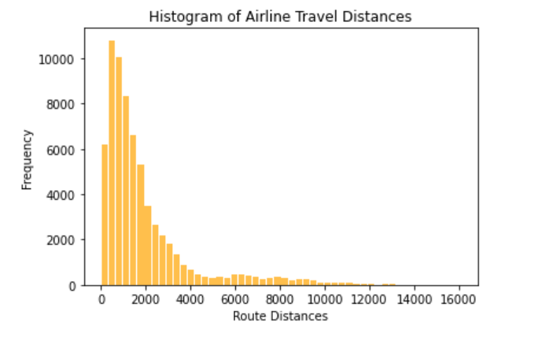

# Lab 5: Airport Histogram Data
Due: 20th November 2020

This repo contains one script titled `Jess-Strzempko_Airport-histogram-data_IDCE30274Lab5.ipynb`. This script was created as part of Lab 5: Airport Histogram Data for IDCE 30274: Computer Programming in GIS taught by Professor Shadrock Roberts at Clark University. 

The data used in this lab can be acceed online at [OpenFlights project](https://openflights.org/). Visit the [OpenFlights data page](https://openflights.org/data.html) and download their airports data file `airports.dat` and airline routes file `routes.dat`. `airports.dat` contains information on each airport including unique airport ID, location by latitude and longitude, and country name. `routes.dat` stores every unique flight route that OpenFlights knows about. If, for some reason, you can't access the OpenFlights page or download the data, there is an archived data set in the data folder of this tutorial for both the [airport data](data/airports.dat) and [routes data](data/routes.dat).

The script contains four challenges that teach how to import, manipulate, and analyze data to students. The first challenge is to print all of the airport names for Russia from the file `airport.dat`. This is completed by using an if statement to index into the country columns to select only airports with country == Russia. The second challenge builds two dictionaries mapping the unique airport ID to the geographic coordinates (latitude & longitude) to look up the location of each airport by its ID. The third challenge reads the `routes.dat` file to get the IDS of the source and destination airports. It then looks up the latitude and longitude based on the ID and calculates the length of each route based on the ID. Each route distance is appended to the list of all route length. The fourth challenge plots a histogram based on the route lengths to visualize the distribution of distances flown. The last three challenges are cumulative and code blocks should be run in consecutive order. 

**Output:**

## Why is this lab important?
**provided by the professor**

Up to now, we've been learning about the basics of Python and have done work manipulating strings, lists, dictionaries, and have started importing files such as `.txt` files. In this lab, we're going to be working with multiple files in `.csv` format. Spreadsheets are, for better or worse, the _lingua franca_ of humanitarian and international development data. As [Sarah Telford of the UN's Humanitarian Data Exchange platform tells it](https://www.devex.com/news/opinion-humanitarian-world-is-full-of-data-myths-here-are-the-most-popular-91959), "Big data is promising, but the challenge in the humanitarian sector is bringing together small amounts of non-standardized data, mostly stored in spreadsheets, from dozens of organizations to create a common picture of needs and response."

The ability to find tabular (ie. spreadsheet) data; explore it; manipulate it; and analyze it is a critical skill. Not only that, but just being able to provide basic graphical representation of quantitative information (our histogram of flight distances) to help decision makers understand the basics of data, is important. Again, to cite the article above, "...cleaning and combing data and making choices about how data will be presented... is different than drawing conclusions from the data to understand why a crisis is deteriorating, or to decide whether to prioritize a cash response rather than food distribution. Data experts create the visuals; subject matter experts do the analysis." It's important to understand that, sometimes, your role as a GIS analyst may be to prepare and display data for decision makers or subject matter experts (and [there are a LOT of them](https://blog.veritythink.com/post/60157407408/these-are-the-humanitarian-decision-makers)) for them to interpret.  

# The Code
All data can be accessed and downloaded publicly and script can be re-run using modified file paths and names. If questions arise, users can contact Jess Strzempko at JeStrzempko@clarku.edu for more help and further information.
